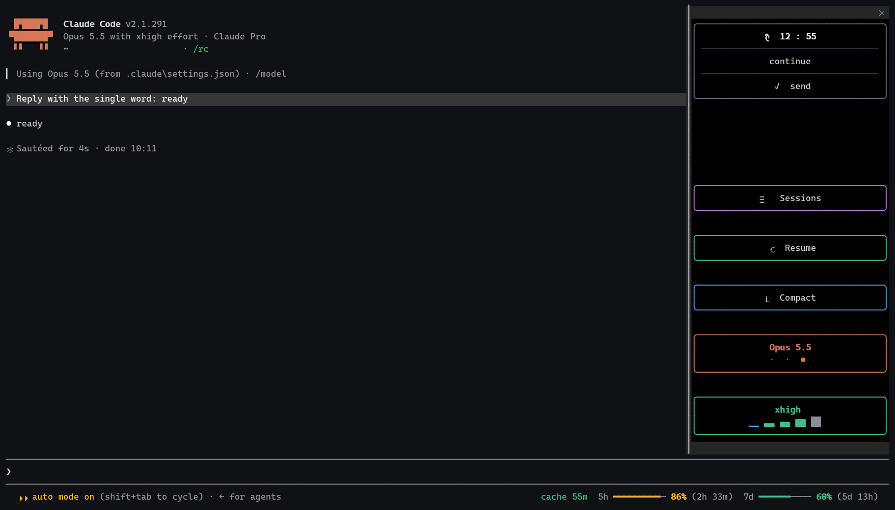

# ClauDiscombobulating

Mod for Claude Code (console + Claude desktop). One plugin, mode picks itself by app.



| | Console | Desktop app |
| --- | --- | --- |
| Usage limits (5h, 7d) | footer | band above prompt |
| Cache timer | footer (after 5 min idle) | band above prompt (always) |
| Cache alert (toast + sound, 10 min before miss; off at 99%+ limits or right after a compact) | yes | yes |
| Auto compact at 99% of the 5h limit | yes | yes |
| Model / effort pickers | above prompt | - |
| Context usage counter | above the prompt (right) | under the prompt |
| Side pane: message timer, Sessions, Resume, Compact, model, effort | yes | - |

- **Auto compact:** when the 5h limit reaches 99%, a running turn is stopped and `/compact` runs, once per 5h window. Better a controlled compact now than the work dying on its own and re-reading the whole context after the reset. It does not resume the work afterwards. Skipped when a compaction (manual or the engine's own) already ran in the last 10 min. The limit is checked every 5 min below 75%, every minute from 75%, every 30 s from 90%, every second from 95%.
- **Sessions** opens `/resume`. **Resume** sends `--resume` (console) and asks first when cache is already missed — not asked at 99%+ limits or right after a compact.
- **Compact** on cache miss: switches to Sonnet low, compacts, restores model + effort.
- **Language:** Ukrainian when the system language is Ukrainian, English otherwise (`d`, `h`, `m`, `send`, `cancel`, …). Force it with env `CLAUDISCOMBOBULATING_LANG=uk` or `en`.
- **Limits shared between sessions:** every session shows the freshest limits, not only after its own first reply. Works on Windows, macOS and Linux.
- Cache alert sound: `plugin/assets/cache-alert.mp3`, installed with the plugin. Windows: system toast + sound. macOS: sound (system player, `afplay`) + in-app toast. Other systems: in-app toast only.

## Install

Needs the `claude` CLI. One line, nothing to clone.

**Windows** (PowerShell):

```powershell
& ([scriptblock]::Create((irm https://raw.githubusercontent.com/Niedvin/ClauDiscombobulating/main/install.ps1)))
```

**macOS / Linux**:

```bash
curl -fsSL https://raw.githubusercontent.com/Niedvin/ClauDiscombobulating/main/install.sh | bash
```

Restart Claude Code and the desktop app. One install serves both the console and the desktop app.

### Why the script and not the two manual commands

- **Auto-update is on from the start.** The script writes the `autoUpdate` entry into `settings.json` for you. With the manual commands the mod never updates, until you edit that file by hand. A new release reaches you when its `version` goes up, nothing to run.
- **Install and update are the same line.** An old copy is removed first, so rerunning it updates right now, repairs a broken install, or moves an old one to the GitHub copy.
- **Moves you off the old name.** An install made under the previous name `prompt-bar` is found and removed, so you do not end up with two copies.
- **Your settings stay.** Only the one `extraKnownMarketplaces` key is touched, and `settings.json` is copied to `.backups/` first (the copy is checked to be non-empty). The file is replaced in one step, never half-written.
- **One line to undo.** The same script with `-Uninstall` (Windows) or `--uninstall` (macOS / Linux) removes the plugin, the marketplace and the auto-update entry.
- **Same result on every system.** One source of truth, no copy-pasting JSON, no editing a file by hand on Windows and a different one on Mac.
- **Readable.** Both scripts are short and sit in this repo: [install.ps1](install.ps1), [install.sh](install.sh). Read before you run.
- **Your own fork.** `-Repo owner/name` (Windows) or env `CLAUDISCOMBOBULATING_REPO=owner/name` (macOS / Linux) installs and auto-updates from a fork instead.

By hand (no auto-update):

```
claude plugin marketplace add Niedvin/ClauDiscombobulating
claude plugin install ClauDiscombobulating@ClauDiscombobulating --scope user
```

Updates are pulled only when `version` in `plugin/.claude-plugin/plugin.json` goes up.

## Uninstall

```powershell
& ([scriptblock]::Create((irm https://raw.githubusercontent.com/Niedvin/ClauDiscombobulating/main/install.ps1))) -Uninstall
```

```bash
curl -fsSL https://raw.githubusercontent.com/Niedvin/ClauDiscombobulating/main/install.sh | bash -s -- --uninstall
```
